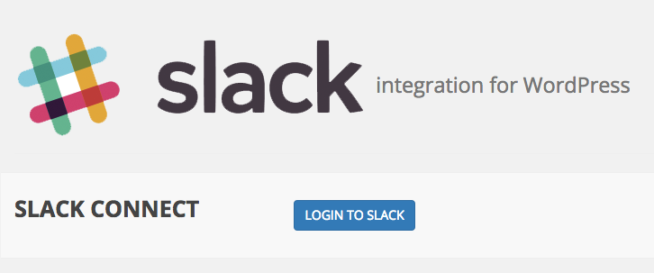
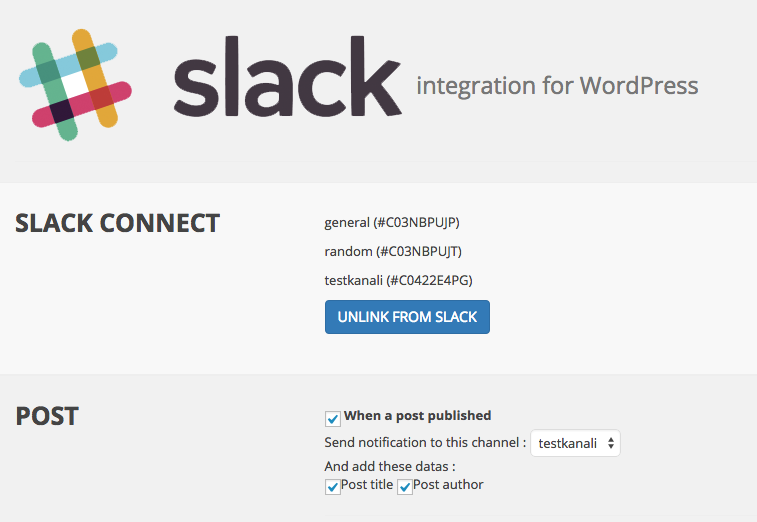
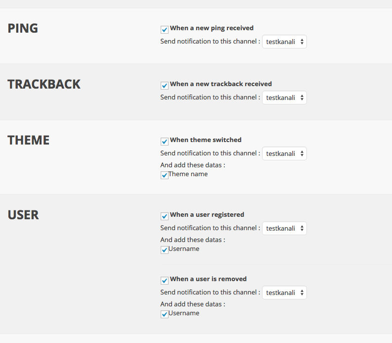

# <small>for WordPress</small>

----------

**Build Status:**           
**Tested with:** WordPress 3.6.1, WordPress 4.1.1  **and WordPress 4.2.2**     
**Tested with:** PHP 5.4 and PHP 5.5   
**License:** [The MIT License](http://opensource.org/licenses/MIT)

----------

# REQUIREMENTS
1. `short_open_tag` must be enabled in *php.ini* file, it's usually enabled by default. If not, [check this.](http://php.net/manual/en/ini.core.php#ini.short-open-tag)

# FEATURES
This plugin sends notifications when

 1. a new post/page/**custom post type** published
 2. a post/page/**custom post type** updated
 3. a post/page/**custom post type** deleted
 4. a new comment pending approval 
 5. a new category created 
 6. a new category deleted
 7. a new ping received 
 8. a new trackback received 
 9. theme switched
 10. a new user registered
 11. a user is removed
 12. a user logged in **NEW FEATURE**

# FOR DEVELOPERS
You can send custom Slack notifications within your theme or plugin . To achieve this, **slack-wordpress** declares a global variable `$slack_plugin` for you. You can send notification like this :

    <?php
    global $slack_plugin;
    $channel_to_post = 'CXXXXXXXX';
    $msg = 'test';
    $slack_plugin->getApi()->publish_post($channel_to_post, $msg);

`publish_post()` returns response of [chat.postMessage](https://api.slack.com/methods/chat.postMessage) , you can look at **Response** section. Also you can check **Formatting** section to formatting your message.

# SCREENSHOTS

# AUTHOR
* [Eray Alakese](http://eray.rocks)

# CONTRIBUTORS
* [wormeyman](https://github.com/wormeyman)
* [Cartor](https://github.com/Cartor)
* [likol](https://github.com/likol)