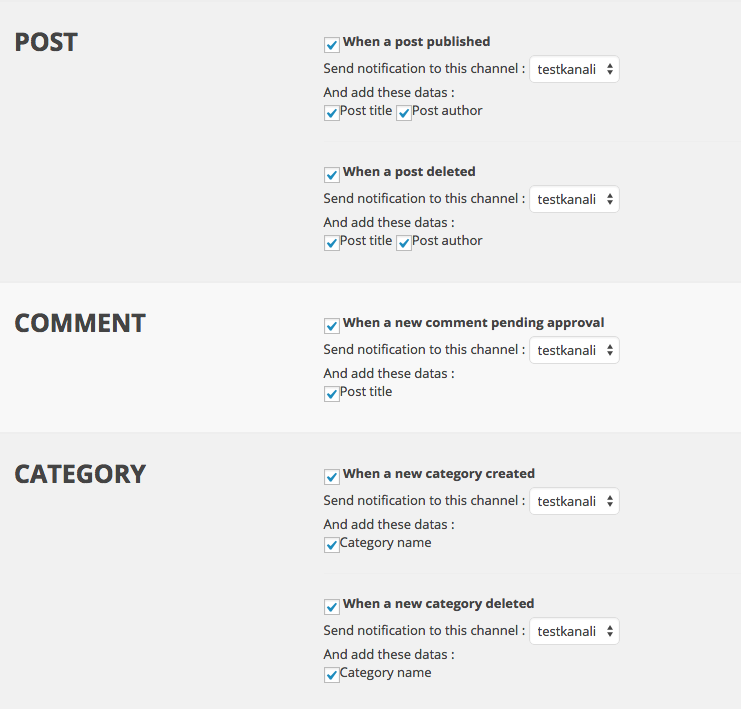

# <small>for WordPress</small>

----------

**Build Status:**   
**Tested with:** WordPress 3.6.1 and WordPress 4.1.1  
**Tested with:** PHP 5.4 and PHP 5.5   
**License:** [The MIT License](http://opensource.org/licenses/MIT)

----------

# FEATURES
This plugin sends notifications when

 1. a new post published
 2. a post deleted
 3. a new comment pending approval 
 4. a new category created 
 5. a new category deleted
 6. a new ping received 
 7. a new trackback received 
 8. theme switched
 9. a new user registered
 10. a user is removed

# SCREENSHOTS

